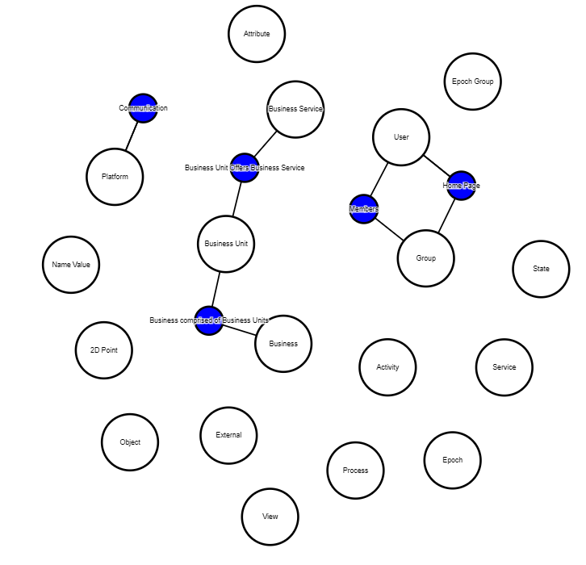

[README](../../README.md)

# D3 Meta Model

MooD Meta Model chart using D3 framework

# Table of Contents

*   [Purpose](#purpose)
*   [Data Summary](#data-summary)
*   [Style](#style)
    * [CSS](#css)
    * [Properties (JSON)](#properties-json)
*   [Inputs](#inputs)
*   [Outputs](#outputs)
*   [Actions](#actions)
*   [Data Details](#data-details)

# Purpose
The chart renders a MooD Meta Model using D3's force-directed layout which uses a physics based simulator for positioning visual elements.

The version of D3 used for this chart is v3.

[Table of Contents](#table-of-contents)

# Data Summary

The Meta Model visualization consumes a single data set. The details of the attributes of the data set is provided in the section Data Details section
1.	__Meta__
    * The meta model of a MooD repository

[Table of Contents](#table-of-contents)

# Style

The style of the visualization is controlled by CSS and a collection of properties.

## CSS

A Cascading Style Sheet (CSS) is defined containing selectors for the following HTML elements in the rendered diagram. The CSS is editable within MooD BA, allowing control of the visual styling of the diagram:

*	Text
*   Text Shadow
*   Path Link
*   Circle

[Table of Contents](#table-of-contents)

## Properties (JSON)

The properties are:

*	__Node Colour__: The colour that nodes (circles) in the meta model are drawn in.
*	__Relationship Colour__: The colour that relationships (circles) are drawn in.
*	__Node Line Colour__: The colour of the line drawn between a node and a relationship.
*	__Edge Colour__: The colour of the edge drawn around nodes and relationships.
*	__Show Icons__: Not used
*	__Min Node Size__: The minimum radius that D3 is permitted to use for drawing circles. This defines the radius of relationships.
*	__Max Node Size__: The maximum radius that D3 is permitted to use for drawing circles. This defines the radius of nodes.
*   __Ignore Nodes__: An array of names or identifiers (GUIDs) of nodes to exclude from the rendered diagram.

[Table of Contents](#table-of-contents)

# Inputs

The visualization has no inputs.

[Table of Contents](#table-of-contents)

# Outputs

The visualization has no outputs.

[Table of Contents](#table-of-contents)

# Actions

The visualization has no actions.

[Table of Contents](#table-of-contents)

# Data Details

1.	__Meta__ – The meta model in the MooD repository. This conforms to the [MooDMetaModel interface](../../docs/data-shape-schema.md#graphql-interfaces)

[Table of Contents](#table-of-contents)

[README](../../README.md)
