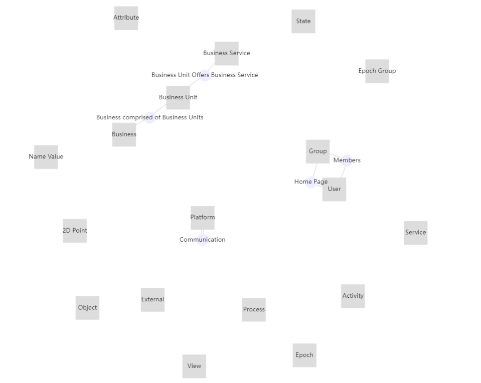

# ECharts Meta Model

MooD Meta Model chart using Apache ECharts framework

[README](../../README.md)

## Table of Contents

* [Purpose](#purpose)
* [Data Summary](#data-summary)
* [Style](#style)
  * [CSS](#css)
  * [Properties (JSON)](#properties-json)
* [Inputs](#inputs)
* [Outputs](#outputs)
* [Actions](#actions)
* [Data Details](#data-details)

## Purpose

The chart renders a MooD Meta Model using ECharts's [graph with force-directed layout](https://echarts.apache.org/examples/en/editor.html?c=graph-force) which uses a physics based simulator for positioning visual elements.

Documentation on configuring an ECharts graph can be found [here](https://echarts.apache.org/en/option.html#series-graph.layout)

[Table of Contents](#table-of-contents)

## Data Summary

The Meta Model visualization consumes a single data set. The details of the attributes of the data set is provided in the section Data Details section

1. __Meta__
    * The meta model of a MooD repository

[Table of Contents](#table-of-contents)

## Style

The style of the visualization is controlled by a collection of properties.

### CSS

None: ECharts style is customised in data not via a Cascading Style Sheet.

[Table of Contents](#table-of-contents)

### Properties (JSON)

The properties are:

* __Node Colour__: The colour that nodes (rectangles) in the meta model are drawn in.
* __Relationship Colour__: The colour that relationships (circles) are drawn in.
* __Ignore Nodes__: An array of names or identifiers (GUIDs) of nodes to exclude from the rendered diagram.

[Table of Contents](#table-of-contents)

## Inputs

The visualization has no inputs.

[Table of Contents](#table-of-contents)

## Outputs

The visualization has no outputs.

[Table of Contents](#table-of-contents)

## Actions

The visualization has no actions.

[Table of Contents](#table-of-contents)

## Data Details

1. __Meta__ – The meta model in the MooD repository. This conforms to the [MooDMetaModel interface](../../docs/data-shape-schema.md#graphql-interfaces)

[Table of Contents](#table-of-contents)

[README](../../README.md)
