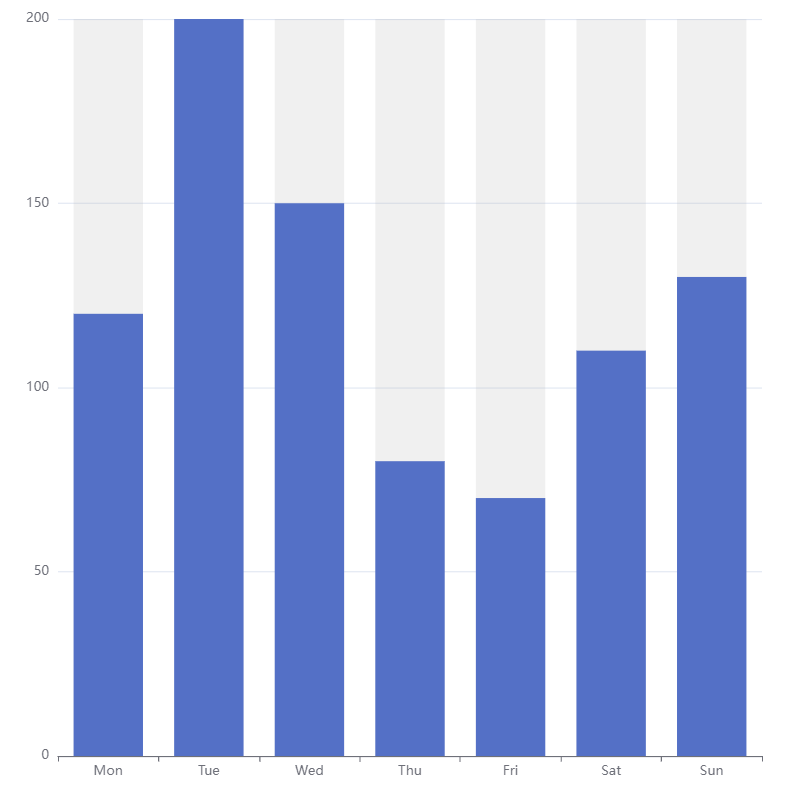

# ECharts Bar Chart

Apache ECharts Bar with Background chart

[README](../../README.md)

## Table of Contents

* [Purpose](#purpose)
* [Data Summary](#data-summary)
* [Style](#style)
  * [Properties (JSON)](#properties-json)
* [Inputs](#inputs)
* [Outputs](#outputs)
* [Actions](#actions)
* [Data Details](#data-details)

## Purpose

The bar chart renders the data as vertical bars. The bars are ordered along the x axis according to the order of the data. The height of each bar is determined by the y value of the data. The x and y axes are scaled automatically to fit within the container.

The custom visualization is based on the ECharts Bar with Background example. The background can be disabled via [styling](#style).

[Table of Contents](#table-of-contents)

## Data Summary

The bar chart visualization consumes a single data set. The details of the attributes of the data set is provided in the section Data Details section

1. __Rows__
    * A list of variables to visualise

[Table of Contents](#table-of-contents)

## Style

The style of the visualization is controlled by a collection of properties.

__Note:__ Styling via CSS is not possible. ECharts charts are styled via options set in code. This is largely because the preferred implementation for rendering the chart, for browser performance reasons, is on a "canvas" which hides the components from the browser.

### Properties (JSON)

The properties mirror the properties in the __options__ object used to configure the ECharts chart. Further properties can be added be updating the code in this example. See [ECharts Chart Configuration](https://echarts.apache.org/en/option.html#title) for the complete list of available properties.

* __backgroundColor__: defines the background colour of the container for the chart. Supports setting as solid color using rgb(255,255,255), rgba(255,255,255,1), #fff. __Default rgba(255, 255, 255, 1)__
* __series__: styling properties for the chart elements
  * __showBackground__: Selects whether or not a background for the vertical bars is drawn. __Default true__
  * __backgroundStyle__: If __showBackground__ is true, defines the style for the background.
    * __color__: the colour of the background. Supports setting as solid color using rgb(255,255,255), rgba(255,255,255,1), #fff. __Default rgba(180, 180, 180, 0.2)__

[Table of Contents](#table-of-contents)

## Inputs

The visualization has no inputs.

[Table of Contents](#table-of-contents)

## Outputs

The visualization has no outputs.

[Table of Contents](#table-of-contents)

## Actions

The visualization has no actions.

[Table of Contents](#table-of-contents)

## Data Details

1. __Rows__ – zero or more elements
    * __x__: the name of the data element. This appears as the label on the x-axis
    * __y__: the value of the data element. This defines the height of the bar

[Table of Contents](#table-of-contents)

[README](../../README.md)
