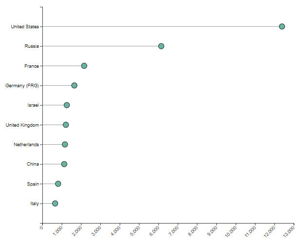

# Lollipop

Lollipop chart

[README](../../README.md)

## Table of Contents

* [Purpose](#purpose)
* [Data Summary](#data-summary)
* [Style](#style)
  * [CSS](#css)
  * [Properties (JSON)](#properties-json)
* [Inputs](#inputs)
* [Outputs](#outputs)
* [Actions](#actions)
* [Data Details](#data-details)

## Purpose

A lollipop chart is a bar chart, where the bar is transformed into a line and a dot. It shows the relationship between a numeric and a categoric variable. The lollipop custom visualization is based on D3 Ordered Lollipop 

The categories are drawn on the vertical (y) axis and the values are on the horizontal (x) axis. The lollipop lines are drawn horizontally. The categories on the y axis are ordered by value, with the category with the minimum value appearing at the bottom and the category with the maximum value appearing at the top.

The x-axis range is enlarged in such a way that its minimum and maximum are nicely-rounded values, i.e. multiples of 2, 5 and powers of 10. The chart can be configured to include zero on the x-axis.

[Table of Contents](#table-of-contents)

## Data Summary

The Lollipop visualization consumes a single data set. The details of the attributes of the data set is provided in the section Data Details section

1. __Rows__
    * A list of variables to visualise

[Table of Contents](#table-of-contents)

## Style

The style of the visualization is controlled by CSS and a collection of properties.

### CSS

A Cascading Style Sheet (CSS) is defined containing selectors for the following HTML elements in the rendered diagram. The CSS is editable within MooD BA, allowing control of the visual styling of the diagram:

* Background colour
* Tick text (axis label) font size

[Table of Contents](#table-of-contents)

### Properties (JSON)

The properties are:

* __margin__: defines the size of a margin around the edge of the chart
  * __top__: size of margin across the top in pixels. __Default 5__
  * __bottom__: size of margin across the bottom in pixels. This defines the space reserved for the x-axis labels. __Default 40__
  * __left__: size of margin across the left-hand side in pixels. This defines the space reserved for the y-axis labels. __Default 150__
  * __right__: size of margin across the right-hand side in pixels. __Default 5__
* __lineStroke__: The colour of the line drawn (lollipop stick). __Default: grey__
* __circleStroke__: The colour of the outline of the lollipop circle. __Default: black__
* __circleFill__: The colour of the lollipop circle. __Default: #69b3a2 (green)__
* __circleRadius__: The radius of the lollipop circle in pixels. __Default: 7__
* __includeXZero__: Selects if the range of the X-axis should include zero value (true) or not (false). If false, the range of the X-axis runs from the minimum value to the maximum value in the dataset. __Default: true__

[Table of Contents](#table-of-contents)

## Inputs

The visualization has no inputs.

[Table of Contents](#table-of-contents)

## Outputs

The visualization has no outputs.

[Table of Contents](#table-of-contents)

## Actions

The visualization has no actions.

[Table of Contents](#table-of-contents)

## Data Details

1. __Rows__ – zero or more elements
    * __Name__: the name of the category
    * __Value__: the value associated with the category

[Table of Contents](#table-of-contents)

[README](../../README.md)
