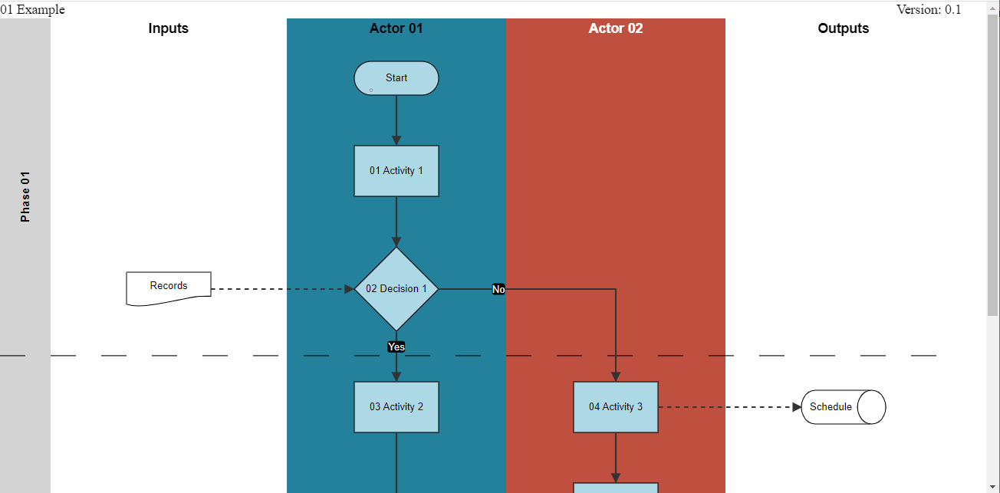

[README](../../README.md)

# ProcessFlow
Draw a Process Flow

# Table of Contents

*   [Purpose](#purpose)
*   [Process Flow Visualisation](#process-flow-visualisation)
    *   [Data Summary](#data-summary)
    *   [Style](#style)
        * [CSS](#css)
        * [Properties](#properties)
    *   [Inputs](#inputs)
    *   [Outputs](#outputs)
    *   [Actions](#actions)
*   [Process Flow Header](#process-flow-header)
    *   [Data Summary](#header-data-summary)
    *   [Style](#header-style)
        * [CSS](#header-css)
        * [Properties](#header-properties)
    *   [Inputs](#header-inputs)
    *   [Outputs](#header-outputs)
    *   [Actions](#header-actions)
*   [Data Details](#data-details)
    

# Purpose

The Process Flow visualisation renders a process: a set of activities (steps), with their inputs and outputs, joined into a sequence (flow) by links between them. The elements (activities, inputs and outputs) are automatically positioned on the diagram and the flows (links) between the elements are routed around the elements.

A process can be a collaboration between different organisations (actors) within an enterprise. The collaboration is represented by partitioning the activities into swim-lanes, where each swim-lane corresponds to the organisation performing the activity. The swim-lanes are drawn vertically on the diagram. A swim-lane is drawn on the left for Inputs, and a swim-lane on the right for Outputs.

A process can be partitioned into phases. Each phase is a sequence of activities that achieve a goal within the overall process. Phases are demarked with a vertical label and a horizontal line after the last activity in the phase.

A sub-set of activities within the process, that in combination achieve a goal of note, can be placed in a group. The group is visualised with a labelled rectangle that encloses the activities in the group.

User interaction between the visualisation and the underlying model in MooD is supported. In particular, the user can click on diagram elements to navigate to details of the element. Also the user can click on an element to highlight it and other related elements.

The Process Flow package contains two visualisations:
-   __Process Flow Visualisation__
    -  This renders the process flow. It can be used standalone (using watermarks in the swim-lanes to identify the actore) or in conjunction with __Process Flow Header__
-   __Process Flow Header__
    -  This renders the header of the Process. The visualisation panel is designed to be setup at the top of the page immediately above the __Process Flow Visualisation__. It needs to be configured in Business Architect to be in a fixed position so that it is always visible (doesn't scroll off the page).

[Table of Contents](#table-of-contents)

# Process Flow Visualisation

## Data Summary
The process flow visualisation consumes nine data sets. The details of the attributes of the data sets is provided in the [Data Details](#data-details) section.

1.	__Process__
    *	Summary information about the process
1.	__Actors__
    *	The set of organisations that each own, or have responsibility for, activities in the process
    *	At least one actor is required
1.	__Phases__
    *	Summary information about each phase in the process
    *	The set is be empty for processes without phases
1.	__Steps__
    *	Details of each step / activity in the process
    *	The order of the steps in the data defines the order that the steps are drawn vertically on the diagram
1.	__StepFlows__
    *	The flow (link) between each step which defines the sequence in which the activities are performed
1.	__StepInputs__
    *	Identifies the inputs that steps have
1.	__StepOutputs__
    *	Identifies the outputs that steps have
1.	__StepGroups__
    *	Summary of a grouping of steps
1.	__StepGroupSteps__
    *	Identifies the steps in a step group

[Table of Contents](#table-of-contents)

## Style
The style of the visualisation is controlled by CSS and a collection of properties.

### CSS

A Cascading Style Sheet (CSS) is defined containing selectors for the following HTML elements in the rendered diagram. The CSS is editable within MooD BA, allowing control of the visual styling of the diagram:
*	Process header
*	Phase label shape
*	Phase label text
*	Phase extent (horizontal line at end of phase)
*	Actor-lane watermark text (for both odd and even lanes)
*	Odd Actor-lane watermark text
*	Even Actor-lane watermark text
*	Actor-lane watermark text box
*	Odd Actor-lane shape
*	Even Actor-lane shape
*	Input / Output lane watermark text
*	Input / Output lane
*	Input / Output generic shape body
*	Input / Output generic shape label
*	Example selectors for specific I/O types, e.g. External Data
*	Step shape
*	Step label
*	Flow label text box
*	Flow label text
*	Step group bounding box
*	Step group label
*	Input / Output shape primary \[direct\] highlight
*	Input / Output shape secondary \[indirect\] highlight
*	Input / Output inner shape primary \[direct\] highlight
*	Input / Output inner shape secondary \[indirect\] highlight
*	Step shape primary \[direct\] highlight
*	Step shape secondary \[indirect\] highlight
*	Link (flow and I/O line) primary highlight
*	Link (flow and I/O line) secondary highlight (not currently in use)

[Table of Contents](#table-of-contents)

### Properties
 The properties are:

*	__verticalSwimlanes__: controls the orientation of the diagram, vertical (true) or horizontal (false) swimlanes: __Default__: true
*   __minimumSwimlaneHeight__: defines the minumum height of swimlanes when drawn horizontally: __Default__: 150
*	__horizontalStepsAllowed__: controls whether multiple steps can be drawn on the same horizontal row if space permits. __Default__: true
*   __horizontalDecisionsAllowed__: controls whether decision steps can be drawn on the same horizontal row as other steps if space permits. __Default__: true
*   __renderProcessHeader__: controls whether the process header (name and version) are drawn. This should be set to false if the __Process Flow Header__ is used, or true if not. __Default__: false
*   __renderSwimlaneWatermarks__: controls whether the swim lane watermarks are drawn. This should be set to false if the __Process Flow Header__ is used, or true if not. __Default__: false
*	__gridSize__: The number of pixels between grid points that shapes and lines are aligned (snap) to. __Default__: 10.
*	__verticalStepSeparation__: The minimum vertical spacing, in pixels, between rows of process steps. The spacing can be larger than this for steps with multiple inputs or outputs. The value is increased, if necessary, to be a multiple of gridSize. __Default__: 40
*	__verticalIOSeparation__: The minimum vertical spacing, in pixels, between inputs or outputs. The value is increased, if necessary, to be a multiple of gridSize. __Default__: 10.
*	__stepStandoff__: The padding, in pixels, around a step that flow lines passing a step will not get closer than. __Default__: 10
*	__ioStandoff__: The horizontal distance, in pixels, that input / output links merge / separate inside the input / output swim-lane: __Default__: 10
*	__linkLabelStandoff__: The distance, in pixels, away from the source step that a flow label is drawn. Where the source and target step are on the same or adjacent rows, the distance may be reduced to fit. __Default__: 70.
*	__processHeaderHeight__: The vertical height, in pixels, allowed for the process header drawn above the diagram: __Default__: 20.
*	__swimlaneWatermarkSpacing__: The vertical spacing, in pixels, between instances of the swim-lane watermarks. __Default__: 400
*	__phaseLabelWidth__: The width, in pixels, of the vertical phase label on the left-hand side of the diagram. This is ignored if there are no phases in the process. The value is increased, if necessary, to be a multiple of gridSize. __Default__: 60.
*	__stepGroupPadding__: The padding, in pixels, applied to the step group bounding box around the steps within. __Default__: 15.
*	__elementSizes__: The height and width of the various shapes, representing different types of step, input and output, drawn on the diagram. The width is increased for steps that appear in multiple swim-lanes.
*	__editable__: indicates if the user can edit (re-position) lines and shapes on the diagram. This should be set to false as editing is not currently supported or saved.
*	__inputSwimlaneLabel__: The text for the swim-lane label (watermark) in the Inputs swim-lane. __Defaults__ to "Inputs" if not specified.
*	__outputSwimlaneLabel__: The text for the swim-lane label (watermark) in the Outputs swim-lane. __Defaults__ to "Outputs" if not specified.
*	__maxFlowLabelSize__: an object defining width and height in pixels of the maximum size a flow / IO link label can be. __Defaults__ to {"width": 100, "height": 60} if not specified.
*	__router__: defines configuration used by the flow / IO link router:
    *	__coincidentLineSpace__: the number of pixels to keep clear either side of a parallel line segment. __Defaults__ to 3 if not specified
    *	__targetTolerance__: the tolerance in x and y coordinates allowed to match the target of two flow / IO link lines. A link line is allowed to coincide with another if they both have the same target. __Defaults__ to 1 if not specified.
    *	__jumpOverOnHorizontalLines__: indicates if line jumps should be drawn on horizontal (true) or vertical (false) lines. __Defaults__ to true if not specified.

[Table of Contents](#table-of-contents)

## Inputs
The visualisation has a single input (Highlight Node) that defines the primary element(s) to highlight on the diagram.

[Table of Contents](#table-of-contents)

## Outputs
The visualisation has no outputs.

[Table of Contents](#table-of-contents)

## Actions
The visualisation reports the following events. These can be configured to trigger actions in MooD. Defining an action to update the visualisation input results in the highlighting of the element identified by the input.
1.	__Process Step Click__ – a mouse click on a process step node
    *	Identifies the element
1.	__Process I/O Click__ – a mouse click on an input or output node
    *	Identifies the element
1.	__Process Click__ – a mouse click on an external process node in the input or output swim-lane
    *	Identifies the element 
1.	__Phase Click__ – a mouse click on a phase label node 
    *	Identifies the element 
1.	__Actor Click__ – a mouse click on an actor (swim-lane) node
    *	Identifies the element 
1.	__Link Click__ – a mouse click on an flow (link) 
    *	Identifies the relationship 
1.	__I/O Link Click__ – a mouse click on an input or output link
    *	Identifies the relationship 
1.	__Activity Group Click__ – a mouse click on a step (activity) group node 
    *	Identifies the element 
1.	__Non-navigable Node Click__ - a mouse click on any node that is defined to be not navigable, e.g. because there is no model to navigate to. This event is provided to allow such nodes to be highlighted by the custom visualisation by mapping the action to an input action. 
    *	Identifies the element
1.	__Test Navigation__ - This event is only triggered during start up and only if the process is [configured to test node navigation](#test-navigation). If required, this event should be configured with just a Navigate action.
    *	Identifies the element or relationship to test for having a model

[Table of Contents](#table-of-contents)

# Process Flow Header

## Header Data Summary
The process flow header consumes three data sets. The data sets are identical to the first three data sets consumed by the __Process Flow Visualisation__. The details of the attributes of the data sets is provided in the [Data Details](#data-details) section.

1.	__Process__ – one element
1.	__Actors__ – one or more relationships
1.	__Phases__ – zero or more elements

[Table of Contents](#table-of-contents)

## Header Style
The style of the header visualisation is controlled by CSS and a collection of properties.

### Header CSS

A Cascading Style Sheet (CSS) is defined containing selectors for the following HTML elements in the rendered diagram. The CSS is editable within MooD BA, allowing control of the visual styling of the diagram:
*	Process header
*   Column header text
*	Phase header rectangle
*	Actor-lane header text (for both odd and even lanes)
*	Odd Actor-lane header text
*	Even Actor-lane header text
*	Odd Actor-lane header rectangle
*	Even Actor-lane header rectangle
*	Input / Output lane header rectangle
*	Input / Output lane header text

[Table of Contents](#table-of-contents)

### Header Properties
The properties are a subset of those in the __Process Flow Visualisation__. They must have the same values as in the __Process Flow Visualistion__ to ensure that the header aligns with the process flow diagram:

*	__gridSize__: The number of pixels between grid points that shapes and lines are aligned (snap) to. __Default__: 10.
*	__processHeaderHeight__: The vertical height, in pixels, allowed for the process header drawn above the diagram: __Default__: 20.
*	__phaseLabelWidth__: The width, in pixels, of the vertical phase label on the left-hand side of the diagram. This is ignored if there are no phases in the process. The value is increased, if necessary, to be a multiple of gridSize. __Default__: 60.
*	__editable__: indicates if the user can edit (re-position) lines and shapes on the diagram. This should be set to false as editing is not currently supported or saved.
*	__inputSwimlaneLabel__: The text for the Inputs swim-lane header. __Defaults__ to "Inputs" if not specified.
*	__outputSwimlaneLabel__: The text for the Outputs swim-lane header. __Defaults__ to "Outputs" if not specified.

[Table of Contents](#table-of-contents)

## Header Inputs
The visualisation has no inputs.

[Table of Contents](#table-of-contents)

## Header Outputs
The visualisation has no outputs.

[Table of Contents](#table-of-contents)

## Header Actions
The visualisation has no actions.

[Table of Contents](#table-of-contents)

## Data Details
1.	__Process__ – one element
    *	__Name__: name of the process. Defaults to the Name property of the element.
    *	__Version__: the version / issue number of the process.
    *   __Test node navigation__: Indicates if the process flow diagram nodes, e.g. Process Steps, should be checked to see if they have a model to navigate to (true) or not (false). If set to true, the checks are done using the [__Test Navigation__ event](#test-navigation-event) which needs to be configured with just a Navigate action, i.e. no Input action. If checks are performed, the primary events, e.g. __Process Step Click__ and __Process I/O Click__ will only be triggered if the node has a model; if no model the __Non-navigable Node Click__ event is triggered instead. If checks are not performed the primary events are triggered and where there is no model the Navigate action is greyed out (or a warning message is displayed if Navigate is the only action).
1.	__Actors__ – one or more relationships. There are 3 ways of defining the swim-lane background and text colours: on relationship to actor, on actor element, or on an element related to the actor.
    *	__Target__: one element
        *	__Name__: name of the actor. Defaults to the Name property of the element.
        *	__Colour of swim-lane__: colour to use as background for swim-lane if not defined on the relationship to actor. This is optional; if not specified the colour on the element related to the actor will be used
        *	__Colour of swim-lane watermark text__: colour to use for text in swim-lane watermark if not defined on the relationship to actor. This is optional; if not specified the colour on the element related to the actor will be used
        *   __Colours defined in related element__: one element
            *	__Colour of swim-lane__: colour to use as background for swim-lane if not defined on the relationship to actor or on actor itself. This is optional; if not specified the colour for odd and even swim-lanes defined in CSS will be used
            *	__Colour of swim-lane watermark text__: colour to use for text in swim-lane watermark if not defined on the relationship to actor or on actor itself. This is optional; if not specified the colour for odd and even swim-lane watermark text defined in CSS will be used
    *	__Colour of swim-lane__: colour to use as background for swim-lane. This is optional; if not specified the colour is taken from the colour on the actor element
    *	__Colour of swim-lane watermark text__: colour to use for text in swim-lane watermark. This is optional; if not specified the colour is taken from the colour on the actor element 
    *   __Number of swimlanes for actor__: the number of swimlanes available to layout steps belonging to the actor. This is optional; if not specified it defaults to 1
1.	__Phases__ – zero or more elements
    *	__Name__: name of the phase. Defaults to the Name property of the element.
1.	__Steps__ – one or more elements
    *	__Name__: name of the step. Defaults to the Name property of the element.
    *	__Step Type__: the type of the step, e.g. Process Step or Decision
    *	__Swimlane ranges(s)__: one or more relationships
        *   __Actor__: one element
            *    __Name__: Name of the actor
        *   __Index of leftmost swimlane under actor__: the index number (1 to number of swimlanes for the actor) of the leftmost swimlane in the actor area that the step occupies. This is optional; if not specified it defaults to 1
        *   __Index of rightmost swimlane under actor__: the index number (1 to number of swimlanes for the actor) of the rightmost swimlane in the actor area that the step occupies. This is optional; if not specified it defaults to the leftmost swimlane, i.e. a width of 1 swimlane
    *	__Phase__: zero or one element
        *	__Name__: Name of the phase
    *   __Prevent step sharing row with next step__: Indicates if the step is prevented from sharing the row with the next step. This is optional; if not specified it defaults to false
1.	__StepFlows__ – zero or more relationships
    *	__Source__: one element
        *	__Name__: Name of the source step
    *	__Target__: one element
        *   __Name__: Name of the target step
    *	__Label__: the text for the label to be displayed on the flow where applicable
    *   __Position of label along flow__: the distance, in pixels, away from the source step that the label is drawn. This is optional and if not defined, defaults to the style property __linkLabelStandoff__.
    *	__Draw with Off Page Connectors__: Indicates if the link from source step to target step should be drawn directly (false) or indirectly (true) using an off page output connector linked to the source step and an off page input connector linked to the target step
    *	__Off Page Output Connector Label__: Label for off page output connector. Must be defined where Draw with Off Page Connectors is true.
    *	__Off Page Input Connector Label__: Label for off page intput connector. If not defined then the connector is not drawn. This is to allow a single connector to be drawn where there are multiple off-page connections into the same step. At least one label must be defined for a target step where Draw with Off Page Connectors is true.
    *	__Drawing sequence number__: Defines the sequence in which flows are drawn (lower number before higher number). This is optional, flows with undefined sequence are drawn after flows with defined sequence in source step then target step order. Defined sequence numbers should be between 1 and 999,999. This can be used to resolve drawing conflicts and also to improve the appearance of flow routes.
    *   __Information contained in Flow__: Details of information element(s) carried by the flow. Zero or more relationships
        *   __Information__: one element
            *   __Name__: Name of the information
            *	__Short Name__: short name to use as label for information; the full name appears in a hover-over (tooltip). If not defined the full name is used as the label and no hover-over appears.
            *	__Type__: the type of information element, e.g. External Data
            *	__Label__: text to use as label for the link between information and step
    *   __Side of step to flow out of__: The side of the source process step that the flow should connect to. This is optional and if unspecified the side will be selected automatically. Values are "left", "right", "top" and "bottom"
    *   __Side of step to flow into__: The side of the target process step that the flow should connect to. This is optional and if unspecified the side will be selected automatically. Values are "left", "right", "top" and "bottom"
1.	__StepInputs__ – zero or more relationships
    *	__Step__: one element
        *	__Name__: name of step
    *	__Input__: one element
        *	__Name__: name of input
        *	__Short Name__: short name to use as label for input; the full name appears in a hover-over (tooltip). If not defined the full name is used as the label and no hover-over appears.
        *	__Type__: the type of input element, e.g. External Data
        *	__Label__: text to use as label for the link between input and step
1.	__StepOutputs__ – zero or more relationships
    *	__Step__: one element
        *	__Name__: name of step
    *	__Output__: one element
        *	__Name__: name of output
        *	__Short Name__: short name to use as label for output; the full name appears in a hover-over (tooltip). If not defined the full name is used as the label and no hover-over appears.
        *	__Type__: the type of output element, e.g. External Data
        *	__Label__: text to use as label for the link between step and output where the link is defined as a flow (see below)
        *	__Flow__: indicates if the link from step to output should be drawn as a flow (true) or as an output (false)
1.	__StepGroups Steps__ – zero or more elements
    *	__Name__: name of the activity (step) group. Defaults to the Name property of the element.
    *	__Label Position__: a picklist value defining where the activity group label should be drawn. If undefined, a free corner within the bounding box is chosen, and if no free corner the label is positioned above the box.
1.	__StepGroupSteps__ – zero or more relationships
    *	__Activity Group__
        *	__Name__: name of activity (step) group
    *	__Step__ 
        *	__Name__: name of step

[Table of Contents](#table-of-contents)

[README](../../README.md)

