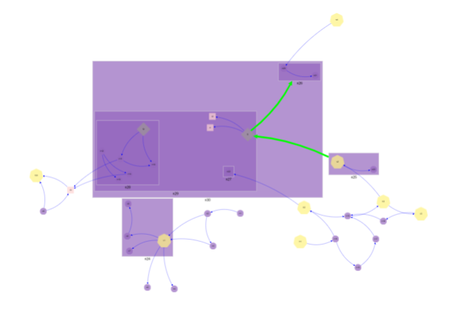

# Fast Compound Spring Embedder Layout

Force Directed Layout of a hierarchy of linked nodes using Cytoscape framework

[README](../../README.md)

## Table of Contents

* [Purpose](#purpose)
* [Data Summary](#data-summary)
* [Style](#style)
  * [CSS](#css)
  * [Properties (JSON)](#properties-json)
* [Inputs](#inputs)
* [Outputs](#outputs)
* [Actions](#actions)
* [Data Details](#data-details)
* [Cytoscape Style](#cytoscape-style)
* [Fast Compound Spring Embedded layout default options](#fast-compound-spring-embedded-layout-default-options)

## Purpose

The chart renders a set of linked nodes using the fCoSE plugin for Cytoscape. The chart supports nesting of nodes (compound) to group them together.

For example a server with a set of ports that it communicates with ports in other servers.

[](https://github.com/iVis-at-Bilkent/cytoscape.js-fcose)

[Table of Contents](#table-of-contents)

## Data Summary

The Meta Model visualization consumes two data sets: nodes and links. The details of the attributes of the data set is provided in the section Data Details section

1. __Nodes__
    * The list of nodes
1. __Links__
    * List of links between the nodes
1. __Parents__
    * List of links between parent and child nodes

[Table of Contents](#table-of-contents)

## Style

The style of the visualization is controlled by CSS and a collection of properties.

### CSS

A Cascading Style Sheet (CSS) is defined containing selectors for the following HTML elements in the rendered diagram. The CSS is editable within MooD BA, allowing control of the visual styling of the diagram:

* Chart Background Colour

[Table of Contents](#table-of-contents)

### Properties (JSON)

The properties are:

* __ignoreUnknownNodes__: Indicates if links in the links dataset involving source ot target nodes not in the nodes dataset should be ignored (true) or reported as an error (false). __Default true__
* __nodeLabelSize__: The size of the font for node labels. __Default 12__
* __nodeLabelFamily__: A font family or a comma separated list of font names to use for node labels. __Default Sans-Serif__
* __nodeLabelWeight__: The weight of the font for node labels: normal, bold, bolder, lighter. __Default normal__
* __nodeLabelStyle__: The style of the font for node labels: normal, italic, oblique. __Default normal__
* __nodeLabelPos__: The vertical positioning of node labels: top, center or bottom. __Default center__
* __nodeLabelMarginX__: The horizontal offset to apply to the positioning of node labels, negative or positive. __Default 0__
* __nodeLabelMarginY__: The vertical offset to apply to the positioning of parent node labels, negative or positive. __Default 0__
* __nodeOpacity__: The opacity of the node fill colour, between 0 and 1. __Default 0.5__
* __nodeHighlightOpacity__: The opacity of the node fill colour when the cursor is hovering over it, between 0 and 1. __Default 1.0__
* __nodeHighlightColour__: The node fill colour when the cursor is hovering over it. If undefined the colour is unchanged when the cursor is over it. __Default null__
* __nodeHighlightInEdges__: When the cursor is hovering over a node, including parent nodes, highlight edges flowing into the node. __Default false__
* __nodeHighlightOutEdges__: When the cursor is hovering over a node, including parent nodes, highlight edges flowing out of the node. __Default false__
* __parentLabelSize__: The size of the font for parent node labels. __Default 12__
* __parentLabelFamily__: A font family or a comma separated list of font names to use for parent node labels. __Default Sans-Serif__
* __parentLabelWeight__: The weight of the font for parent node labels: normal, bold, bolder, lighter. __Default normal__
* __parentLabelStyle__: The style of the font for parent node labels: normal, italic, oblique. __Default normal__
* __parentLabelPos__: The vertical positioning of parent node labels: top, center or bottom. __Default center__
* __parentLabelMarginX__: The horizontal offset to apply to the positioning of parent node labels, negative or positive. __Default 0__
* __parentLabelMarginY__: The vertical offset to apply to the positioning of parent node labels, negative or positive. __Default 5__
* __parentOpacity__: The opacity of the parent node fill colour, between 0 and 1. __Default 0.5__
* __parentHighlightOpacity__: The opacity of the parent node fill colour when the cursor is hovering over it, between 0 and 1. __Default 1.0__
* __parentHighlightColour__: The parent node fill colour when the cursor is hovering over it. If null the colour is unchanged when the cursor is over it. __Default null__
* __edgeOpacity__: The opacity of the edge line, between 0 and 1. __Default 0.5__
* __edgeHighlightOpacity__: The opacity of the edge line when the cursor is hovering over it, between 0 and 1. __Default 1.0__
* __edgeHighlightColour__: The colour of the edge line when the cursor is hovering over it. If null the colour is unchanged when the cursor is over it. __Default null__
* __edgeCurveStyle__: The curving method used to separate two or more edges between two nodes; may be _haystack_ (default, very fast, bundled straight edges for which loops and compounds are unsupported), _straight_ (straight edges with all arrows supported), _straight-triangle_ (straight triangle edges), _bezier_ (bundled curved edges), _unbundled-bezier_ (curved edges for use with manual control points), _segments_ (a series of straight lines), _round-segments_ (a series of straight lines with rounded corners), _taxi_ (right-angled lines, hierarchically bundled), _round-taxi_ (right-angled lines, hierarchically bundled, with rounded corners). Note that haystack edges work best with ellipse, rectangle, or similar nodes. Smaller node shapes, like triangle, will not be as aesthetically pleasing. Also note that edge endpoint arrows are unsupported for haystack edges. __Default unbundled-bezier__
* __edgeArrowShape__: The shape of the edge’s target arrow; may be one of: triangle, triangle-tee, circle-triangle, triangle-cross, triangle-backcurve, vee, tee, square, circle, diamond, chevron, none. __Default triangle__
* __idealEdgeLength__: The ideal length of an edge. The length is altered by the node repulsion forces and the elasticity of the edges. __Default 150__
* __edgeElasticity__: A divisor to compute edge forces, range 0 < elasticity < 1. A smaller number will generally lead to longer edges and more separated nodes. __Default 0.99__
* __zoomSensitivity__: Sensitivity of mouse wheel to control zoom. This is a multiplier, with a lower number decreasing the zoom step size. __Default 0.3__
* __nodeSeparation__: Separation amount between nodes. This setting appears to be largely constrained by the repulsive forces, edge elasticity and ideal edge length. __Default 75__
* __nodeRepulsion__: The repulsive force between nodes. __Default 4500__
* __busyNodeRepulsion__: An additional repulsive force, multiplied by the number of edges connected to the node, that the node exerts. This helps to separate nodes with lots of edges and avoid labels overlapping. __Default 1000__
* __gravity__: Gravity force for nodes, attracting them to the centre point. __Default 0.25__
* __gravityCompound__: Gravity force for compound nodes, attracting them to the centre point. __Default 1.0__
* __samplingType__: Type of node sampling performed to generate layout: random (false) or greedy (true). __Default true__
* __nodeDimensionsIncludeLabels__: Whether to include labels in node dimensions. When true this helps to avoid long node labels overlapping. __Default true__

[Table of Contents](#table-of-contents)

## Inputs

The visualization has no inputs.

[Table of Contents](#table-of-contents)

## Outputs

The visualization has two outputs.

* __Node__: the identity of the node element that the cursor is hovering over
* __Link__: the identity of the link relationship that the cursor is hovering over

[Table of Contents](#table-of-contents)

## Actions

The visualization has one event. This can be configured to trigger actions in MooD, e.g. navigation

1. __Node Click__: a mouse click on a node
    * Identifies the element
1. __Link Click__: a mouse click on a link
    * Identifies the relationship

[Table of Contents](#table-of-contents)

## Data Details

1. __Nodes__ – Zero or more elements; the list of nodes to visualise
    * __Name__: Name of the node
    * __Colour of node__: The colour to draw the shape representing the node
    * __Shape of node__: The shape to draw for the node. See [Shapes](#shapes) for valid values.
    * __Size of Shape__: Size specifying both the height and width of the shape
    * __Drawing Order__: The drawing order determines which nodes appear on top of others. A node with a higher value will be drawn on top of a node with a lower value. __Default 1__
1. __Links__ - Zero or more relationships; the list of links between nodes
    * __Source__: The source node of the link
        * __Name__: The name of the source node
        * __Colour of link__: The colour to draw the link line. If not defined, the __Colour of link__ defined for the target is used
    * __Target__: The target node of the link
        * __Name__: The name of the target node
        * __Colour of link__: The colour to draw the link line. If not defined, the __Colour of link__ defined for the link is used
    * __Weight of link__: Controls width of the line drawn between the nodes.
    * __Colour of link__: The colour to draw the link line. If not defined, the __Link Colour__ defined in the style is used
    * __Type of line to draw for link__: Line type for the link, solid, dotted or dashed. __Default solid__
    * __Pattern for dashed lines__: The pattern to apply when the line type is dashed. This is a pair of numbers, e.g. "5 5" which define the length of the solid and blank sections of the line
1. __Parents__ - Zero or more relationships; the list of parent-child relationships
    * __Child__: The child node
        * __Name__: The name of the child node
    * __Parent__: The parent node
        * __Name__: The name of the parent node

[Table of Contents](#table-of-contents)

## Cytoscape Style

For reference, see full list of [styling available in Cytoscape](https://js.cytoscape.org/#style)

### Shapes

Valid shapes are:

* ellipse
* triangle
* round-triangle
* rectangle
* round-rectangle
* bottom-round-rectangle
* cut-rectangle
* barrel
* rhomboid
* right-rhomboid
* diamond
* round-diamond
* pentagon
* round-pentagon
* hexagon
* round-hexagon
* concave-hexagon
* heptagon
* round-heptagon
* octagon
* round-octagon
* star
* tag
* round-tag
* vee

__Not supported in Custom Viz (yet at least)__:

_polygon_ (custom polygon specified via shape-polygon-points)

_shape-polygon-points_ : An array (or a space-separated string) of numbers ranging on [-1, 1], representing alternating x and y values (i.e. x1 y1 x2 y2, x3 y3 ...). This represents the points in the polygon for the node’s shape. The bounding box of the node is given by (-1, -1), (1, -1), (1, 1), (-1, 1). The node’s position is the origin (0, 0).

[Table of Contents](#table-of-contents)

## Fast Compound Spring Embedded layout default options

```javascript
        // 'draft', 'default' or 'proof' 
        // - "draft" only applies spectral layout 
        // - "default" improves the quality with incremental layout (fast cooling rate)
        // - "proof" improves the quality with incremental layout (slow cooling rate) 
        quality: "default",
        // Use random node positions at beginning of layout
        // if this is set to false, then quality option must be "proof"
        randomize: true, 
        // Whether or not to animate the layout
        animate: true, 
        // Duration of animation in ms, if enabled
        animationDuration: 1000, 
        // Easing of animation, if enabled
        animationEasing: undefined, 
        // Fit the viewport to the repositioned nodes
        fit: true, 
        // Padding around layout
        padding: 30,
        // Whether to include labels in node dimensions. Valid in "proof" quality
        nodeDimensionsIncludeLabels: false,
        // Whether or not simple nodes (non-compound nodes) are of uniform dimensions
        uniformNodeDimensions: false,
        // Whether to pack disconnected components - cytoscape-layout-utilities extension should be registered and initialized
        packComponents: true,
        // Layout step - all, transformed, enforced, cose - for debug purpose only
        step: "all",
        
        /* spectral layout options */
        
        // False for random, true for greedy sampling
        samplingType: true,
        // Sample size to construct distance matrix
        sampleSize: 25,
        // Separation amount between nodes
        nodeSeparation: 75,
        // Power iteration tolerance
        piTol: 0.0000001,
        
        /* incremental layout options */
        
        // Node repulsion (non overlapping) multiplier
        nodeRepulsion: node => 4500,
        // Ideal edge (non nested) length
        idealEdgeLength: edge => 50,
        // Divisor to compute edge forces
        edgeElasticity: edge => 0.45,
        // Nesting factor (multiplier) to compute ideal edge length for nested edges
        nestingFactor: 0.1,
        // Maximum number of iterations to perform - this is a suggested value and might be adjusted by the algorithm as required
        numIter: 2500,
        // For enabling tiling
        tile: true,
        // The comparison function to be used while sorting nodes during tiling operation.
        // Takes the ids of 2 nodes that will be compared as a parameter and the default tiling operation is performed when this option is not set.
        // It works similar to ``compareFunction`` parameter of ``Array.prototype.sort()``
        // If node1 is less then node2 by some ordering criterion ``tilingCompareBy(nodeId1, nodeId2)`` must return a negative value
        // If node1 is greater then node2 by some ordering criterion ``tilingCompareBy(nodeId1, nodeId2)`` must return a positive value
        // If node1 is equal to node2 by some ordering criterion ``tilingCompareBy(nodeId1, nodeId2)`` must return 0
        tilingCompareBy: undefined, 
        // Represents the amount of the vertical space to put between the zero degree members during the tiling operation(can also be a function)
        tilingPaddingVertical: 10,
        // Represents the amount of the horizontal space to put between the zero degree members during the tiling operation(can also be a function)
        tilingPaddingHorizontal: 10,
        // Gravity force (constant)
        gravity: 0.25,
        // Gravity range (constant) for compounds
        gravityRangeCompound: 1.5,
        // Gravity force (constant) for compounds
        gravityCompound: 1.0,
        // Gravity range (constant)
        gravityRange: 3.8, 
        // Initial cooling factor for incremental layout  
        initialEnergyOnIncremental: 0.3,
      
        /* constraint options */
      
        // Fix desired nodes to predefined positions
        // [{nodeId: 'n1', position: {x: 100, y: 200}}, {...}]
        fixedNodeConstraint: undefined,
        // Align desired nodes in vertical/horizontal direction
        // {vertical: [['n1', 'n2'], [...]], horizontal: [['n2', 'n4'], [...]]}
        alignmentConstraint: undefined,
        // Place two nodes relatively in vertical/horizontal direction
        // [{top: 'n1', bottom: 'n2', gap: 100}, {left: 'n3', right: 'n4', gap: 75}, {...}]
        relativePlacementConstraint: undefined,
      
        /* layout event callbacks */
        ready: () => {}, // on layoutready
        stop: () => {} // on layoutstop
      };
```

[Table of Contents](#table-of-contents)

[README](../../README.md)
