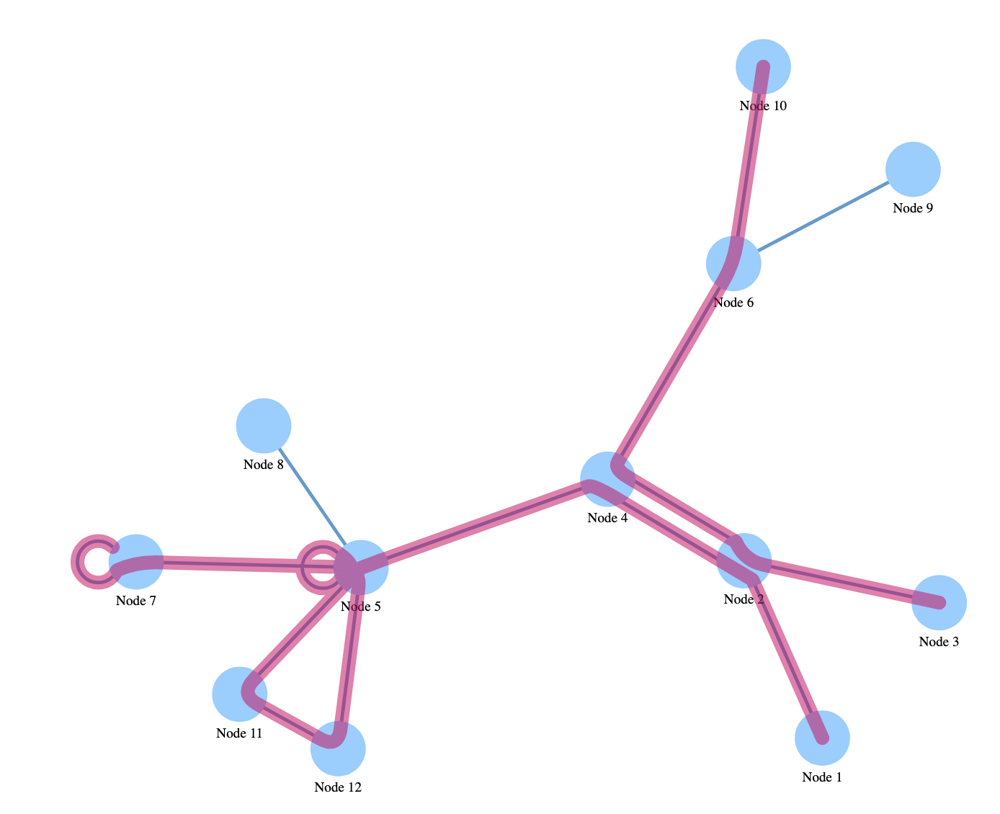
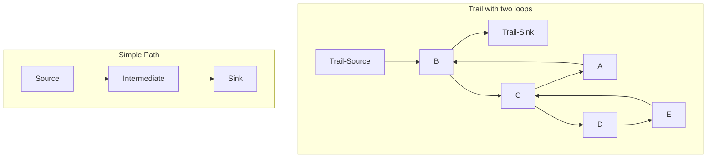
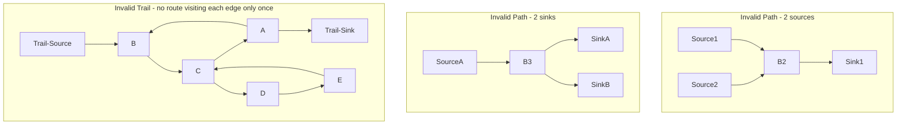

# V Network Graph

Force Directed Layout of linked nodes with path ovrlays using Vue framework

[README](../../README.md)

## Table of Contents

* [Purpose](#purpose)
* [Data Summary](#data-summary)
* [Style](#style)
  * [CSS](#css)
  * [Properties (JSON)](#properties-json)
* [Inputs](#inputs)
* [Outputs](#outputs)
* [Actions](#actions)
* [Data Details](#data-details)

## Purpose

The chart renders a set of linked nodes using D3's force-directed layout which uses a physics based simulator for positioning visual elements. Paths and Trails through the graph can be overlayed on top.

### Proposed Enhancements

* [Icons on Nodes](https://dash14.github.io/v-network-graph/examples/appearance.html#custom-node)
* [Specify colour for nodes, lines and paths](https://dash14.github.io/v-network-graph/examples/paths.html#coloring)
* [Add a map layer underneath graph](https://dash14.github.io/v-network-graph/examples/layers.html#map)
* [Animate path lines](https://dash14.github.io/v-network-graph/examples/paths.html#animation) 

### Example Paths and Trails

A Trail is a route through part of the graph involving a distinct set of edges. The trail can include loops and hence a node can be visited more than once. The entire trail can be a loop. If the trail with a loop has both a source node and a sink node they must flow in and out of the loop via the same node

A Path is a route through part of the graph involving a distinct set of nodes. A Path has no loops and a single source (starting) node and a single sink (ending) node.

See definition of path and trail here in [graph theory](https://en.wikipedia.org/wiki/Path_(graph_theory))

[Table of Contents](#table-of-contents)

## Data Summary

The Meta Model visualization consumes three data sets: nodes, edges and paths. The details of the attributes of the data set is provided in the section Data Details section

1. __Nodes__
    * The list of nodes
1. __Edges__
    * List of edges (links) between the nodes
1. __Paths__
    * List of edges (links) between the nodes

[Table of Contents](#table-of-contents)

## Style

The style of the visualization is controlled by CSS and a collection of properties.

### CSS

A Cascading Style Sheet (CSS) is defined containing selectors for the following HTML elements in the rendered diagram. The CSS is editable within MooD BA, allowing control of the visual styling of the diagram:

Note: __No styling currently defined__

[Table of Contents](#table-of-contents)

### Properties (JSON)

The properties are:

* __showArrows__: Indicates if an arrow marker should be drawn at the target end of the link (true) or not (false). __Default false__

[Table of Contents](#table-of-contents)

## Inputs

The visualization has no inputs.

[Table of Contents](#table-of-contents)

## Outputs

The visualization has three outputs.

* __Node Hover__: the identity of the node that the cursor is hovering over
* __Edge Hover__: the identity of the edge that the cursor is hovering over
* __Path Hover__: the identity of the path that the cursor is hovering over

[Table of Contents](#table-of-contents)

## Actions

The visualization has one event. This can be configured to trigger actions in MooD, e.g. navigation

1. __Node Click__: a mouse click on a node
    * Identifies the element
1. __Edge Click__: a mouse click on an edge
    * Identifies the relationship between two nodes
1. __Path Click__: a mouse click on a path
    * Identifies the element

[Table of Contents](#table-of-contents)

## Data Details

1. __Nodes__ – Zero or more elements; the list of nodes to visualise
    * __Name__: Name of the node
    * __X Coordinate__: X Coordinate of position of node. __Currently ignored, position determined by force directed algorithm__
    * __Y Coordinate__: Y Coordinate of position of node. __Currently ignored, position determined by force directed algorithm__
1. __Edges__ - Zero or more relationships; the list of edges (links) between nodes
    * __Source__: The source node of the edge
        * __Name__: The name of the source node
    * __Target__: The target node of the edge
        * __Name__: The name of the target node
1. __Paths__ - Zero or more relationships; the list of edges (links) to Paths
    * __Path__: The Path element
        * __Name__: The name of the Path element
    * __Edge__: The edge relationship
        * __Name__: The name of the edge relationship

[Table of Contents](#table-of-contents)

[README](../../README.md)
