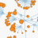
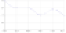
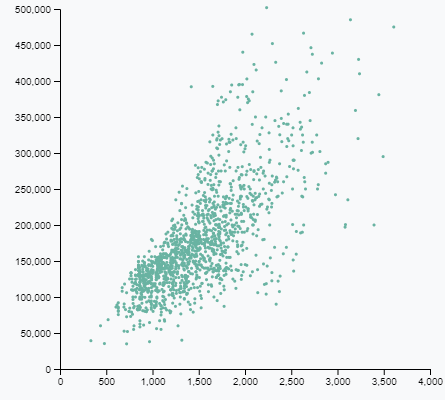
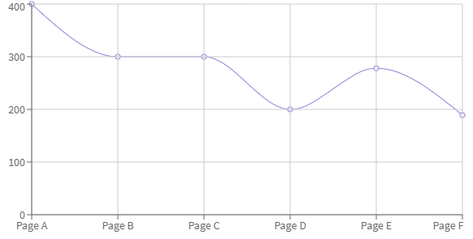

# Visualizations
Templates, examples and documentation enabling you to bring 3rd party visualizations into your MooD Repository.

See the [wiki](https://github.com/CACIMooD/Visualizations/wiki) for more articles and guides.

#### The easiest way to get started is to clone this repository and then modify the various examples / templates inside Visual Studio Code.

# Table of Contents

*   [Introduction](#introduction)
*   [Example Custom Visualisations](#example-custom-visualisations)
*   [Selecting a chart](#selecting-a-chart)
*   [Development Environment](#development-environment)
    * [Installing Visual Studio Code](#installing-visual-studio-code)
    * [Installing Node.js and NPM](#installing-nodejs-and-npm)
	* [Test the Development Environment](#test-the-development-environment)
* [Creating a workspace](#creating-a-workspace)
* [Customising the template](#customising-the-template)
    * [Understanding the MooD Visualization Architecture](#understanding-the-mood-visualization-architecture)
      * [MooD Active Enterprise (MAE)](#mood-active-enterprise-mae)
      * [Visualization Package Contents](#visualization-package-contents)
      * [Data Shape Schema](#data-shape-schema)
    * [Customisation Process](#customisation-process)
* [Debugging](#Debugging) 
* [Creating the visualization package](#creating-the-visualization-package)
* [Installing the visualization in MooD BA](#installing-the-visualization-in-mood-ba)
* [Using the visualization in MooD BA](#using-the-visualization-in-mood-ba)
* [Web security considerations](#web-security-considerations)

# Introduction
You can use your favourite graphs and charts to visualise your data in MooD Business Architect (BA). Whether you have written your own code or downloaded it from a gallery on the web, this document will guide you through the process to enable you to use the visualization in MooD BA.

You will need to be familiar with, or willing to learn, the following
* Developing software in JavaScript
* Node and Node Package Manager (NPM)
* GraphQL

The guide will show you how to create a visualization package using a Windows PC since MooD BA runs on Windows. However you can install the development tools, Visual Studio Code and Node/NPM, on a Mac or Linux if you prefer.

MooD provides templates for the following JavaScript chart frameworks
* Data Driven Documents (D3)
* Apache ECharts
* React

# Example Custom Visualizations

 [D3 Ordered Lollipop](Examples/Lollipop/README.md)

 [D3 Meta Model](Examples/D3%20Meta%20Model/README.md)

 [ECharts Meta Model](Examples/ECharts%20Meta%20Model/README.md)

 [ECharts Bar Chart](Examples/EChartsBarChart/README.md)

 [ECharts Radial Tree Chart](Examples/EChartsRadialTree/README.md)

 [Process Flow](Examples/ProcessFlow/README.md)

 [Stretched Chord](Examples/StretchedChord/README.md)

 [D3 Word Cloud](Examples/WordCloud/README.md)

 [Webpack D3 Example](Examples/WebpackD3Visualization/README.md)

 [Webpack React Example](Examples/WebpackReactVisualization/README.md)

# Selecting a chart

There is a wealth of example charts on the web which you can use as the basis of your visualization. You should be able to find something that meets you needs or close enough that you can modify without too much effort. If your needs are very particular, you can create the visualization yourself.

[](https://www.d3-graph-gallery.com/graph/scatter_basic.html)
[](http://recharts.org/en-US/guide/getting-started)

D3 and React are both in common usage. Both of these are further supported by chart libraries, e.g. Plotly (D3) and Recharts (React). One of the first decisions you will need to make is the framework you will use for your visualization. Some guidance is available for [choosing a library](https://hackernoon.com/choosing-a-data-visualization-library-for-react-444263a41f98). This is aimed at the React framework, but a lot of the issues are applicable to other frameworks. The top criteria discussed in the article are:
* Your first step should be to __clearly define your use cases__. It sounds obvious, but knowing what you are looking for is the most important criteria in your decision.
* What chart types does your application require? Depending on your audience, you might require simple instead of complex charts. Often, line/area, grouped/stacked bar, and pie/donut charts suffice.
* What kind of customization, formatting, and interactivity do you require in your design? Do you need to be able to customize tick marks? What about showing or hiding grids and axes? Will you need to custom tooltips, legends, and margins? Will you need to format and style your charts significantly? These are all important questions you should also ask.
* After you have concretely defined your requirements, here are the top four questions you should consider:

	1. Is the library __well-documented__ with examples?
	2. How __active__ is the library?
	3. Is the library free or __commercially-licensed__?
	4. How __easily customizable__ are chart components, like tooltips and legends?

## D3 Examples


* [D3 Gallery](https://www.d3-graph-gallery.com/index.html)
* [Observable D3 Gallery](https://observablehq.com/@d3/gallery)
* [Plotly library](https://plotly.com/javascript/)


## ECharts

* [ECharts examples](https://echarts.apache.org/examples/en/index.html)

## React Examples

* [Recharts library](http://recharts.org/en-US/guide/getting-started)
* [Chart.js library](https://www.chartjs.org/docs/latest/)
* [Victory library](https://formidable.com/open-source/victory/) claimed to be used by Airbnb
* [React-Viz library](https://github.com/uber/react-vis) developed by Uber
* [Nivo Rocks library](https://nivo.rocks/#/)

[Table of Contents](#table-of-contents)

# Development Environment

The recommended environment for adapting visualization templates is the following:
* Microsoft Visual Studio Code (VS Code)
* Node.js and Node Package Manager (npm)
* nvm-windows
  * A Node.js installer and version manager specifically for Windows
  * This allows you to install and switch between multiple versions of Node.js
* Webpack
  * A Node.js package used by the visualization templates to build visualization packages for debugging and deploying to MooD Business Architect
  * There is no specific installation required for Webpack as it is installed as part of the node package dependencies declared in the template
  * Node package download and installation is covered in [Test the Development Environment](#test-the-development-environment)
* Chrome browser
  * Any browser that has developer tools for debugging can be substituted for Chrome. VS Code launches your default browser for debugging
* Windows 10
  * All the recommended development tools above, with the exception of nvm-windows, can also be installed on Mac or Linux. However MooD Business Architect only runs on Windows

## Installing Visual Studio Code


Download Visual Studio Code from [here](https://code.visualstudio.com/Download) and run the installer

## Installing Node.js and NPM

  

__Beware__ You will need to restart Visual Studio Code if it is running while you install Node.js and NPM.

See [the guide to installing Node.js and npm](https://docs.npmjs.com/downloading-and-installing-node-js-and-npm). It is recommended to use a Node version manager to install and manage Node.js and npm, but you can use a Node installer if you prefer.

## Test the Development Environment

1. Download or clone this repository containing visualization templates for MooD. Open the example VS Code workspace for the example visualization corresponding to the framework used by your chosen visualization. The workspace can be opened either by double clicking on the workspace (`.code-workspace`) file, or opening VS Code and opening the workspace from the File menu.
2. Open a new terminal window in VS Code from the Terminal menu. In the terminal window, execute `npm install` to download and install all the node modules required by the example visualization. Depending on your internet connection speed and the visualization framework this may take a little while. This should complete with success and no vulnerabilities reported.
3. Launch the example visualization in your default browser by executing `npm start` in the terminal window. Check that no errors are reported by npm in the terminal window and that a visualization appears in the browser. Close the window in the browser and stop the debugging session in the terminal window by pressing Ctrl-C and then entering Y.

[Table of Contents](#table-of-contents)

# Creating a workspace

If you have not already done so, download or clone this repository containing visualization templates for MooD. Create a copy of the folder containing the template corresponding to the framework your chosen visualization is implemented in. Currently there are templates for the following frameworks:

* Data Driven Documents (D3)
* Apache ECharts
* React
* Empty, i.e. no framework

Rename the VS Code workspace file in your newly created working folder to correspond with the name of the folder. You can now open the workspace in VS Code by double clicking the workspace file or opening VS Code and opening the workspace from the File menu.

For reference, there are example visualizations for the frameworks above. You can open these workspaces in VS Code.
 
[Table of Contents](#table-of-contents)

# Customising the template

## Understanding the MooD Visualization Architecture


### MooD Active Enterprise (MAE)

Active Enterprise is the MooD server component that interacts with the browser and more specifically with the visualization. MAE is an ASP.NET component. MAE interacts with the visualization via an entry function and a number of event handler functions that the visualization can optionally override. MAE creates an iFrame for the exclusive use of the visualization which isolates it from any other visualization code on the page. This means that visualizations using different versions of frameworks, e.g. D3, can happily work on the same page.

MooD Active Enterprise will invoke the JavaScript Visualization entry function and pass it a configuration object containing all the information the visualization should need to render and interact with the rest of Active Enterprise.

See [Visualization Configuration Object specification](docs/visualization-configuration-object.md) for details of the object.

### Visualization Package Contents

The visualization package (zip) can contain the following files: 

* `package.json`: a general configuration file for the package
  * This file is used to communicate general configuration settings for this package to MooD Business Architect (MBA). Its specification and format is similar to [CommonJS Descriptor File](http://wiki.commonjs.org/wiki/Packages/1.1#Package_Descriptor_File).  All the relevant properties have been listed and described below:
  *  __Property__: id 
     * This property requires a globally unique identifier (GUID) and is not a standard package.json property, but it is useful to uniquely identify this package of visualization(s)
	 * The visualization template includes a script to generate a GUID for your visualization package
  * __Property__: name 
     * This is the name of the visualization package; MBA uses this as the name of the package displayed in the gallery and also as the name of the visualization if visualization config (`visualization.config.json`) has no name specified
     * The strict rules of CommonJS descriptor file for the name property are not enforced by MBA. The name can include capital letters and spaces. You can safely ignore non-conformity problems reported by your IDE, e.g. VS Code, for this property.
  * __Property__: description
     * A description of the visualization package. MBA will display this in the information section of the flip-side of visualizations in the package that don't have a description of their own
  * __Property__: version 
     * This is the version of the visualization package.  This version will be used and displayed in the list of visualizations within MBA. MBA may use and display two or more versions of the same visualization, if there is no upgrade from one version to another
  * __Property__: supportedVersions 
    * This optional property tells the MooD application what previous versions of visualizations in the package supports (upgrades from) if visualization config (`visualization.config.json`) has no supportedVersions specified.  It would only support previous versions if it could take the configuration and data in the shape provided and transform it (within itself) into the right shape for the newer version
    * The property specifies a root version and all versions from that root are suitable for upgrading. For instance "1.1" means all versions "1.1.0", "1.1.1" etc can be upgraded
    * An example where a new version cannot be upgraded is where a new field is added to the data shape that can't be calculated by the new version
    * Thus, for a non-breaking change, older "supported" versions of the visualization are updated to the new version. Older non-supported versions remain as they were, so you can end up with multiple versions of the visualization in the MooD repository
    * When MooD BA upgrades older supported versions to a new version that involves a change to the data shape, some of the wiring ("pins") may be lost. Thus, when importing a new version you should check existing uses of the visualisation in case they need to be re-pinned
    * This entry being blank or not existing means that there are no previous supported versions and no upgrades will take place. However, individual visualizations can define supportedVersions in `visualization.config.json`

    ```JavaScript
    supportedVersions: "0.1"
    ```
  * __Property__: dependencies 
     * These are a list of dependencies that all visualization in this package requires or contains. It is appended to the list in each `visualization.config.json`
* Visualization Folder 
  * `visualization.config.json`: a configuration file for visualization contained within this package and folder
     * See [visualization.config.json specification](docs/visualization-config-json.md) for details
  * `visualization.dataShape.gql`: the data shape(s) that the visualization requires  - see [Data Shape Schema](#data-shape-schema) below
  * `<visualization>.js`: the code for the visualization
  * `visualization.png`: optional image to identify the visualization in the UI. The image should be 48 by 48 pixels.
* Visualization Folder(s): Any more visualizations contained one per folder if required
* Optional Dependencies folders: 
  * Optional Dependencies files:
  * `<optional>.js`
  * `<optional>.css` 

### Data Shape Schema

This is a GraphQL file called `visualization.dataShape.gql` that defines the schema that the Business Architect uses to determine what fields and series the visualization needs to render itself.  The schema details the structure of the data shape and the types needed. 

See [Data Shape Schema definition](docs/data-shape-schema.md)

## Customisation Process

[Follow the guide to customise the template for your chosen framework](docs/template-customisation-guide.md)


[Table of Contents](#table-of-contents)

# Debugging

Before deploying your visualization to MooD Business Architect you can check that it behaves as expected in the development environment.

If you don't already have one, open a new terminal window in VS Code from the Terminal menu.

Launch the visualization in your default browser by executing `npm start` in the terminal window. Check that no errors are reported by npm in the terminal window and that visualization appears in the browser as expected. Use the development tools in your browser, e.g. Ctrl-Shift-I in Chrome, to inspect the HTML and help diagnose any faults. Amendments to the visualization code made while the debug session is running should be reflected immediately in the browser. If you make changes to webpack configuration you will need to stop the debug session (Ctrl-C) and re-run `npm start`.

Close the window in the browser and stop the debugging session in the terminal window by pressing Ctrl-C and then entering Y.


[Table of Contents](#table-of-contents)

# Creating the visualization package

__Warning: Before attempting to create the package for the first time make sure you have run the `npm start` at least once. This will ensure that all of the generated files exist. Once the generated files exist the webpack configuration will ensure that they are re-generated each time. Failure to do so will result in an error such as__

```
Invalid configuration object. Webpack has been initialised using a configuration object that does not match the API schema
```

MooD imports visualization packages in the form of a zip file. As you have got this far through the guide, generating the zip file is simply achieved by executing the following in the VS Code terminal

```npm run build```


This will create the visualization package zip file `<package name>-<version number>.zip` in the top level folder of your VS Code workspace. You can change the name of the package file that is generated by updating the *ZipFilesPlugin* defined in `webpack.prod.js`

__Note__: this automatically increments the patch number in the semantic version number of the visualization package. This is done to ensure that each time you build the visualization after a code change, MooD will recognise the change. You can manually maintain the semantic version number by editing the top level `package.json` file.

Running the following in the VS Code terminal will generate the visualization package without updating the version number.

```npm run rebuild```


[Table of Contents](#table-of-contents)

# Installing the visualization in MooD BA

Guidance for installing your visualization in a MooD repository are available in the [MooD Enterprise Knowledge Base](https://supportportal.moodinternational.com/)

[Table of Contents](#table-of-contents)

# Using the visualization in MooD BA

Guidance for connecting data in your MooD repository to visualization are available in the [MooD Enterprise Knowledge Base](https://supportportal.moodinternational.com/)

[Table of Contents](#table-of-contents)

# Web security considerations

Visualization JavaScript should be written according to Web security best practices. Particular attention should be paid to ensuring that data received from MooD and from user inputs is added to the DOM using methods which ensure context appropriate encoding to guard against Cross-Site-Scripting attacks.

To protect against Cross-Site-Scripting attacks within the visualization, the visualization is run in a sandboxed iFrame, to which a Content-Security-Policy has been applied, both as a Response Header with the frame page, and as a 'csp' attribute on the iFrame element.

If your visualization needs to perform operations which violate the Content-Security-Policy, e.g. requires connection to external sites to send or retrieve data or resources, the Content-Security-Policy may need modification. 
This modification can be performed by applying a MooD XHTML Action Panel with specific JavaScript set the required 'csp' attribute on the iFrame, and by using the URLRewriter module to override the value of the Content-Security-Policy header returned by the iFrame page.
Specific details of how to do this can be acquired by contacting IIG MooD support.

When crafting an alternative Content-Security-Policy, it is important to ensure that directives are extended in a specific fashion e.g. if the visualization needs to connect to 'mydomain.com' then change connect-src to "'self' mydomain.com" rather than remove the directive.

Alternatively, the Content Security Policy can be modified for __all__ Custom Visualizations. For details, read this [wiki article](https://github.com/CACIMooD/Visualizations/wiki/Content-Security-Policies)

[Table of Contents](#table-of-contents)
