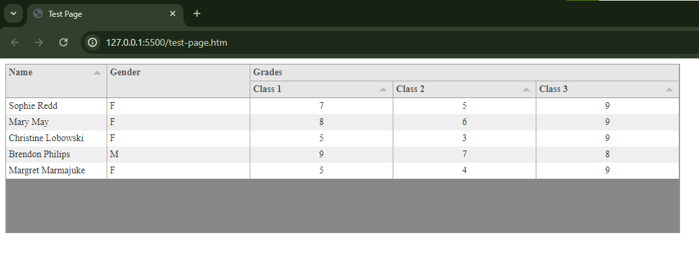
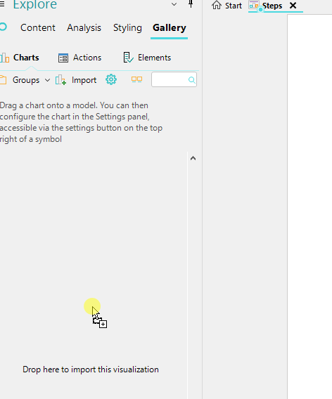
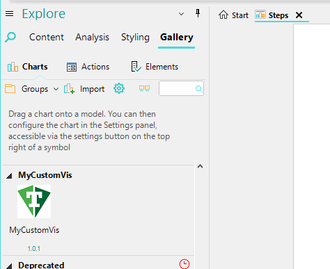
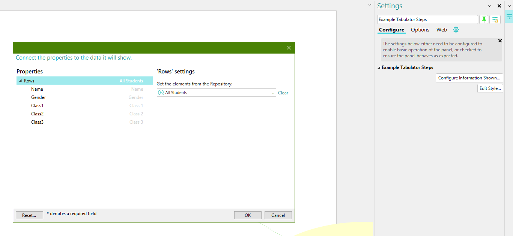

# Quick Start Guide to Custom Visualization using Tabulator

## Initial Setup

**Ensure you have done each of the following before you begin:**

- Install [Visual Studio Code](https://code.visualstudio.com/)
- Install [Node JS](https://nodejs.org/en)
- Install [Git](https://git-scm.com/downloads) and clone/download the [repo](https://github.com/CACIMooD/Visualizations)
- Install MooD Business Architect

## Instructions

1. Create (and rename) a copy of the EmptySimpleTemplate from the Templates folder of Visualizations
1. In Visual Studio Code, open the Visualization workspace file located in that folder
1. In package.json add a generated GUID ([from this site](https://www.guidgenerator.com/)) and change the name to something suitable, for instance here we've chosen "MyCustomVis"
1. In this guide we will use the Tabulator control as an example. Tabulator can be imported in a variety of ways, in this example it will be installed directly:
    - Open a Terminal and create the folder which will contain Tabulator, by running these two lines in order:

        ```cd .\Code\```

        ```mkdir -p node_modules```

    - Run this line to install Tabulator: ```npm install tabulator-tables --save```
    - Tabulator files should now be found in Code/node_modules/tabulator-tables (if not, move the node_modules folder into Code/)
    - The additional dependency automatically added to package.json **should be removed** as it is not needed, and can trigger a warning when using the Visualization in MooD.

    Here is an example of what your package.json should now look like:

    ```json
    {
    "id": "c83959a2-d04f-41a2-b6e4-1f784eccc1e4",
    "name": "MyCustomVis",
    "version": "1.0.0",
    "moodVersion": "16.0.085",
    "main": "/Code/Code.js",
    "dependencies": {}
    }
    ```

1. In Code/visualization.config.json add a newly generated GUID to line 2 (different to package.json), change the name, and add these new dependencies to line 11:

     ```json
      "dependencies":{
        "style": "Code/node_modules/tabulator-tables/dist/css/tabulator.min.css",
        "tabulator": "Code/node_modules/tabulator-tables/dist/js/tabulator.js"
      },
      ```

1. In Code/Code.js edit createVisualization() by replacing lines 6-8 with this code to add a tabulator table to a div:

    ```js
    var createVisualization = function(config, css){
        var elem = document.getElementById(config.element);

        const testDiv = document.createElement('div');

        var table = new Tabulator(testDiv, {
            height:250, // set height of table to enable virtual DOM
            data: testData,
            layout:"fitColumns", //fit columns to width of table (optional)

            columns:[ //Define Table Columns
            {title:"Name", field:"name", sorter:"string", width:150, editor:true},
            {title:"Gender", field:"gender", sorter:"string", headerSort:false, editor:"list", editorParams:{values:{"M":"Male", "F":"Female", "X":"Other"}}},
            
            //Create Column Group
            {title:"Grades",
            columns:[
                {title:"Class 1", field:"class1", sorter:"number", hozAlign:"center", editor:true},
                {title:"Class 2", field:"class2", sorter:"number", hozAlign:"center", editor:true},
                {title:"Class 3", field:"class3", sorter:"number", hozAlign:"center", editor:true}
            ]
            }]
        });

        elem.appendChild(testDiv);
    }

1. Change the testData in test-data.js to values which reflect the columns added in the table (This is only for testing purposes.  Later we will re-route the data to not use testData.):

    ```js
    var testData = [
        {id:1, name:"Sophie Redd", gender:"F", class1:7, class2:5, class3:9},
        {id:2, name:"Mary May", gender:"F", class1:8, class2:6, class3:9},
        {id:3, name:"Christine Lobowski", gender:"F", class1:5, class2:3, class3:9},
        {id:4, name:"Brendon Philips", gender:"M", class1:9, class2:7, class3:8},
        {id:5, name:"Margret Marmajuke", gender:"F", class1:5, class2:4, class3:9}
    ]
    ```

1. Test that the table appears correct in test-page.htm - add the same dependencies to \<head> as were added in visualization.config.json (one will replace the "stylesheet" link, the other will be a new script tag added to the html)

    ```html
    <link rel="stylesheet" type="text/css" href=Code/node_modules/tabulator-tables/dist/css/tabulator.min.css>
    <script type="text/javascript", src="Code/node_modules/tabulator-tables/dist/js/tabulator.js"></script>
    ```

1. Run test-page.htm by pressing F5, or by clicking "Run>Start Debugging" in the header. The expected result is shown below.

1. Once the test page works, change the data shape in visualization.datashape.gql to reflect the row data. This is what allows you to configure the data in MooD.

    ```gql
    type data { 
        rows: [row!]! 
    } 

    type row implements MooDElement { 
        id: ID 
        name: String
        gender: String
        class1: Number
        class2: Number
        class3: Number
    }
    ```

1. In Code.js, change the data variable from testData to config.data.rows

    ```js
    data: config.data.rows,
    ```

1. Change visualization.png to a suitable icon for the visualization (I used the Tabulator logo shown below)

    
1. Convert build.txt into a batch file which can be run to create the visualization:
    - Open build.txt in Notepad and Save As "build.bat"
    - Double-click build.bat in the File Explorer to run it and create visualisations.zip
1. In MooD BA, drag the .zip file from File Explorer into the Gallery tab to add the custom visualization

     
1. Drag the visualization onto a model and click "Configure Information Shown..." in its Settings
1. From here you can use existing fields/data in your repository to link to each field in the table

    
1. When making changes to the custom vis, increment the version number in visualization.config.json (`"version": "1.0.1"`) before running the .bat file again and dragging the new .zip into MooD.
